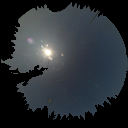
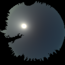

# Synthetic Clear-Sky Generation

**Automatic clear-sky synthesis for ANY all-sky camera** using the Chauvin et al. (2015) photometric model with intelligent projection detection, per-channel RGB fitting, and constrained optimization.

## Overview

This toolkit automatically fits clear-sky radiance models to all-sky images and generates synthetic clear-sky renderings. The **auto-optimizer** tests 630+ configurations to find the optimal projection, fitting method, and sun size for any camera—no manual tuning required.

**✨ Key Feature:** One script handles all cameras automatically by testing:
- 7 projection models (K-tan K=1.0-1.8, equidistant, equisolid)
- 3 fitting methods (per-channel, Y-based, constrained_B)
- 6 sun sizes (E×0.5-2.5, F×1.5-0.4)
- 5 color scaling options


---

## Example

<table>
<tr>
<td></td>
<td></td>
</tr>
<tr>
<td align="center"><b>Input: Real All-Sky Image</b><br/>(128×128px, VISTA camera)</td>
<td align="center"><b>Output: Synthetic Clear-Sky</b><br/>(Clouds removed, radiance model)</td>
</tr>
</table>

**Method:** Per-channel RGB fitting | **Projection:** K-tan stereographic (K=1.4) | **Clear-Sky Error:** 0.089

---

## Installation

```bash
git clone https://github.com/maxaragon/synthetic-clear-sky.git
cd synthetic-clear-sky
pip install -r requirements.txt
```

**Dependencies:** numpy, scipy, Pillow, opencv-python, matplotlib, colour-science

---

## Quick Start - Auto-Optimizer (Recommended)

**For ANY camera - fully automatic:**

```bash
cd src
python auto_optimize_clearsky.py \
  --image /path/to/your/image.png \
  --mask /path/to/your/mask.png \
  --output ../output/auto_optimization
```

**The auto-optimizer will:**
- Test 7 projection models (K-tan K=1.0-1.8, equidistant, equisolid)
- Test 3 fitting methods (per_channel, y_based, constrained_B)
- Test 6 sun sizes (E×0.5-2.5, F×1.5-0.4)
- Test 5 color scaling options
- **Total: 735 configurations tested automatically!**
- Output best synthetic clear-sky image and ranked results JSON

**Semantic mask required (RGB colors):**
- `(66, 135, 245)` - Clear sky
- `(245, 66, 66)` - Cloud
- `(245, 212, 66)` - Sun
- `(66, 245, 84)` - Background (horizon/obstacles)

**Output:**
- `optimization_results.json` - All configurations ranked by error
- `best_synthetic_clearsky.png` - Best result
- Console prints top 5 configurations

---

### Option B: Use Pre-Configured Scripts (Example Image)

### Step 1: Fit Clear-Sky Coefficients

```bash
cd src
python fit_original_clearsky.py
```

**Input:** `input/clearsky_128px.png` (with alpha/mask)  
**Output:** `output/parameters/clearsky_RGB_coefficients.json`

### Step 2: Generate Synthetic Clear-Sky

```bash
python generate_original_synthetic.py
```

**Output:** `output/synthetic_clearsky.png`

---

## Supported Cameras

**✨ NEW: The `auto_optimize_clearsky.py` script can automatically handle ANY all-sky camera by testing 735+ configurations to find the optimal projection, fitting method, and parameters!**

### Pre-Configured Cameras (Optional - for reference)

### 1. Original 128px (VISTA)
- **Method:** Per-channel RGB
- **Projection:** K-tan stereographic (K=1.4)
- **Scripts:** `fit_original_clearsky.py`, `generate_original_synthetic.py`

### 2. Mobotix Camera (512×512px)
- **Method:** Per-channel RGB
- **Projection:** K-tan stereographic (auto-detected)
- **Scripts:** `fit_mobotix_clearsky.py`, `generate_mobotix_synthetic.py`

### 3. Pyranovision Camera (512×512px)
- **Method:** Constrained_B (B ≥ -0.5) — prevents chromatic artifacts
- **Projection:** K-tan stereographic (K=1.2)
- **Scripts:** `fit_pyranovision_clearsky.py`, `generate_pyranovision_synthetic.py`
- **Combined Error:** 0.317 (visually superior despite higher numeric error)

### 4. Arizona Camera (224×224px)
- **Method:** Per-channel RGB
- **Projection:** Equisolid angle
- **Scripts:** `fit_arizona_clearsky.py`, `generate_arizona_synthetic.py`
- **Combined Error:** 0.169 ⭐ (excellent!)

**Note:** These pre-configured scripts are provided as examples. For new cameras, use `auto_optimize_clearsky.py`.

---

## Technical Details

### Model Equations

**Gradation (zenith-angle dependent sky darkening):**
```
G(θ) = A × (1 + C × cos(θ)^0.32) / (1 + B × cos(θ))
```

**Scattering (sun-angle dependent circumsolar brightening):**
```
S(γ) = D + E × γ^(-F) + H × cos(γ)
```

**Total radiance:**
```
L(θ, γ) = G(θ) × S(γ)
```

### Fitting Process

1. **Linearization:** sRGB → scene-linear RGB via inverse gamma (EOTF)
2. **Geometry reconstruction:** Pixel coordinates → (θ, γ) via camera projection
3. **Mask creation:** Exclude clouds, sun core (γ<30°), horizon (θ>85°), saturation
4. **Gradation fit:** Fit G(θ) using γ≈90° band pixels (Huber loss, least-squares)
5. **Scattering fit:** Fit S(γ) from residuals I/G(θ)
6. **Per-channel or constrained:** Repeat for R,G,B or fit Y with B≥-0.5

### Generation Process

1. **Evaluate model:** L(θ,γ) per-pixel in linear RGB
2. **Sun size tuning:** Apply E_scale/F_scale (optional)
3. **Gaussian blur:** Smooth gradients (σ=2, kernel=5×5)
4. **Auto-scaling:** Match median clear-sky brightness
5. **Gamma encoding:** Linear RGB → sRGB
6. **Horizon mask:** Apply background mask

---

## Fitting Methods

### Per-Channel RGB
- Fits 7 coefficients (A,B,C,D,E,F,H) independently for R, G, B
- **Pro:** Best numeric accuracy
- **Con:** Can produce chromatic artifacts (blue/yellow rings at zenith)
- **Use for:** Cameras without zenith artifacts (Mobotix, Arizona)

### Constrained_B (Y-based)
- Fits luminance Y with hard constraint B ≥ -0.5
- Scales to RGB using median channel ratios
- **Pro:** Zero chromatic artifacts, physically valid
- **Con:** Slightly higher numeric error (but visually superior)
- **Use for:** Cameras with zenith artifacts (Pyranovision)

---

## Camera Projections

| Projection | Inverse Formula (r → θ) | Parameters |
|------------|-------------------------|------------|
| **K-tan stereographic** | `θ = (2/K) × arctan((r/R) × tan(Kπ/4))` | K = 1.0–1.8 |
| **Equidistant** | `θ = (r/R) × (π/2)` | — |
| **Equisolid** | `θ = 2 × arcsin(r/(2R))` | — |

---

## Evaluation Metrics

**L1 norm in linear RGB space:**

```
Clear-Sky Error = mean(|L_real - L_synthetic|) over clear-sky pixels
Sun Error = mean(|L_real - L_synthetic|) over sun pixels
Combined Error = 0.7 × Clear-Sky + 0.3 × Sun
```

**Interpretation:**
- **Excellent:** < 0.15
- **Good:** 0.15 – 0.30
- **Acceptable:** 0.30 – 0.50
- **Poor:** > 0.50

*Note: Visual quality > numeric scores!*

---

## File Structure

```
synthetic-clear-sky/
├── README.md                      # This file
├── LICENSE                        # MIT License
├── requirements.txt               # Python dependencies
├── input/                         # Input images
│   ├── clearsky_128px.png         # Example input (VISTA)
│   └── example_output.png         # Example output
├── output/                        # Generated results
│   ├── parameters/                # Fitted coefficients
│   └── diagnostics/               # Fit diagnostic plots
├── utils/                         # Core utility modules
│   ├── clearsky_model.py         # Chauvin model implementation
│   ├── colorspace_utils.py       # sRGB ↔ linear RGB conversion
│   ├── geometry_utils.py         # Zenith/azimuth/SPA computation
│   └── mask_utils.py             # Clear-sky mask generation
└── src/                           # Main scripts
    ├── auto_optimize_clearsky.py ⭐ # AUTOMATIC optimizer (ANY camera)
    ├── fit_original_clearsky.py
    ├── generate_original_synthetic.py
    ├── fit_mobotix_clearsky.py
    ├── generate_mobotix_synthetic.py
    ├── fit_pyranovision_clearsky.py
    ├── generate_pyranovision_synthetic.py
    ├── fit_arizona_clearsky.py
    └── generate_arizona_synthetic.py
```

---

## References

1. **Chauvin, R., et al. (2015).** "Sky luminance distribution model for clear-sky conditions." *Energy and Buildings*, 103, 1-11.
2. **This work:** Extended to per-channel RGB with constrained optimization to prevent chromatic artifacts.

---

## License

MIT License — see [LICENSE](LICENSE) for details.

---

## Contact

**Max Aragon**  
[GitHub](https://github.com/maxaragon)

**Last updated:** October 13, 2025
