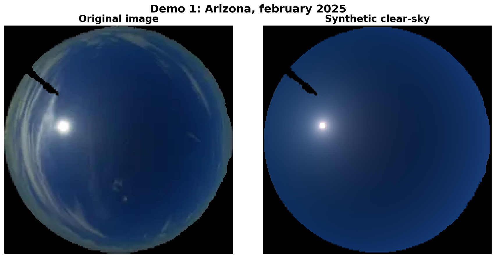
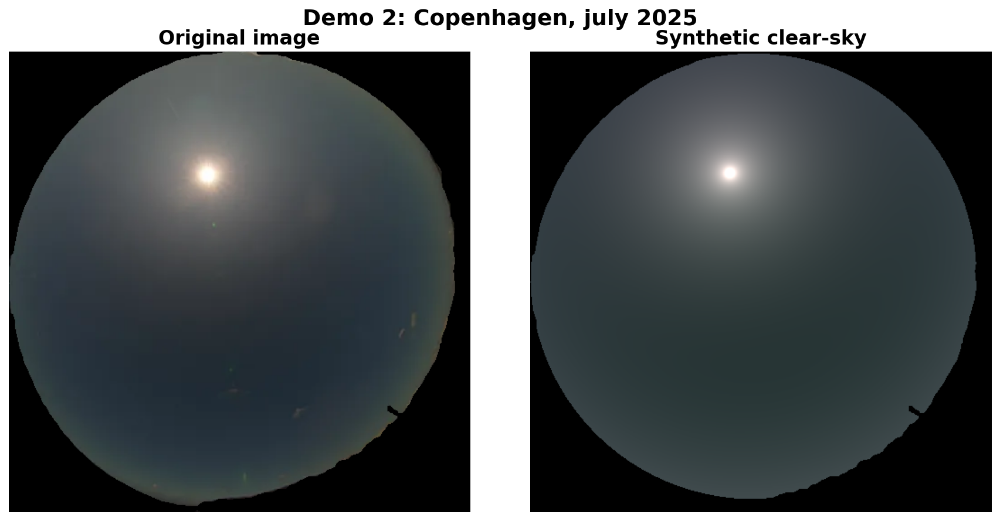
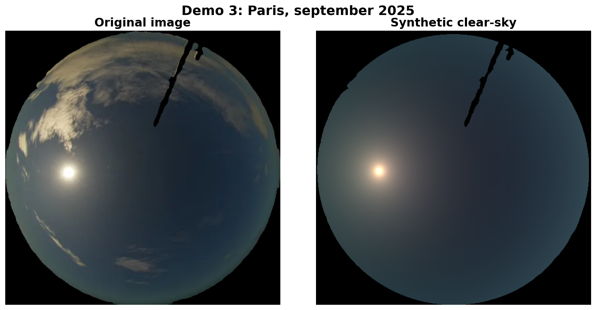
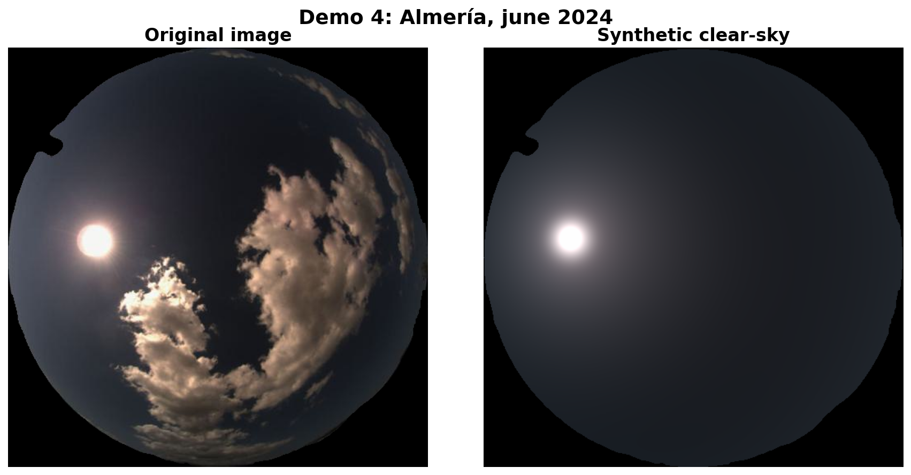
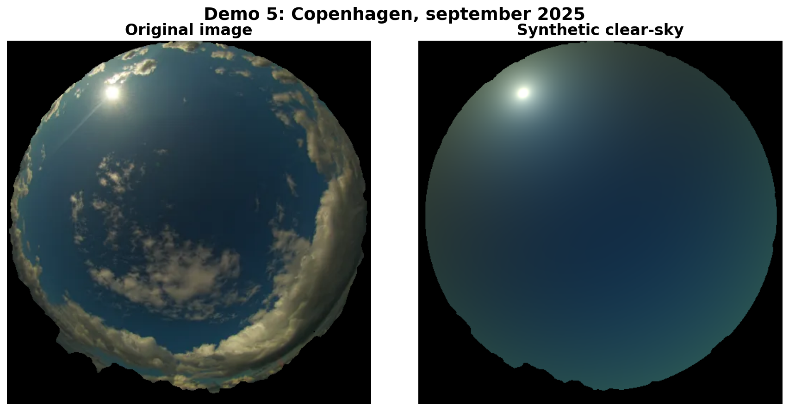

# Synthetic Clear-Sky Generation

Automated pipeline for generating synthetic clear-sky images from real sky images with clouds using the Chauvin et al. (2015) photometric model.

## 🚀 Usage

```bash
# Install dependencies
pip install -r requirements.txt

# Run on an image
python src/synthetic_clearsky_optimizer.py \
    --image path/to/image.png \
    --mask path/to/mask.png \
    --output output_directory
```

**Input requirements:**
- **Image:** RGB fisheye image (PNG, JPG, WEBP)
- **Semantic mask:** PNG with labeled regions:
  - RGB(66, 245, 84): Background
  - RGB(66, 135, 245): Clear sky
  - RGB(245, 66, 66): Cloud
  - RGB(245, 212, 66): Sun

**Output files:**
- `best_synthetic_clearsky.png` - Final synthetic clear-sky
- `best_comparison.png` - Side-by-side comparison
- `optimization_results.json` - Parameters and metrics

## 📊 Results

### Demo 1: Arizona, february 2025


### Demo 2: Copenhagen, july 2025


### Demo 3: Paris, september 2025


### Demo 4: Almería, june 2024


### Demo 5: Copenhagen, september 2025


## 🎯 Method

4-stage hybrid optimizer:

1. **Grid search** - Tests multiple sun sizes and band configurations
2. **Continuous refinement** - Optimizes 21 clear-sky parameters (7 per RGB channel)
3. **Sun enhancement** - Adds realistic sun disk + bloom PSF
4. **Sun parameter grid** - Exhaustive search across 252 configurations

See [TECHNICAL_DOCS.md](TECHNICAL_DOCS.md) for detailed algorithm description and mathematical models.

## 📄 License

See [LICENSE](LICENSE) file.

---

**Version**: Production  
**Last Updated**: 2025-10-18  
**Status**: ✅ Production Ready
